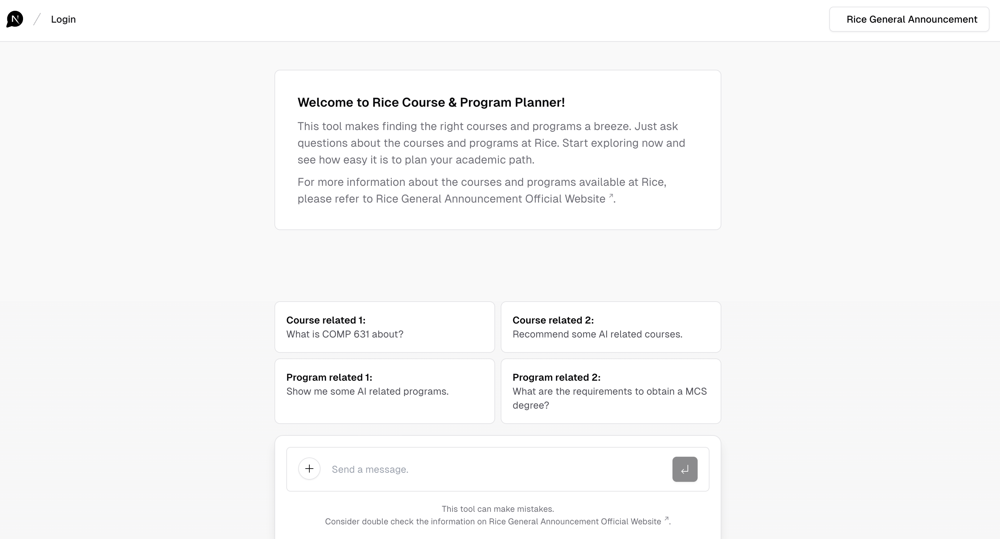
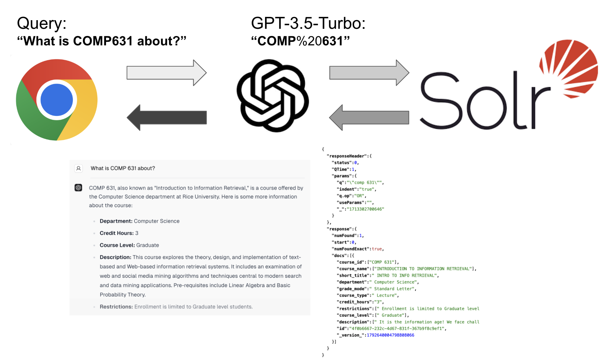

# RiceUCoursePlanner
Rice University Course and Program Selection RAG System

**Project URL**: https://rice-uc-ourse-planner.vercel.app/

***Note that our GPT-3.5 API has limited usage. Kindly avoid excessive use to ensure the availability. Thank you!**

***This URL may become inactive due to reaching the maximum limit of API usage.**
## Overview

This project aims to enhance the academic planning experience at Rice University by streamlining the course and program selection process. Utilizing a custom-built Information Retrieval (IR) system and a LLM, these initiatives simplify access to crucial academic information, making the decision-making process more efficient for students and administrative staff alike.



## Features

- **Web Crawling**: Systematically navigates and downloads content from Rice University's General Announcements webpages, ensuring up-to-date course and program information.
- **Efficient Data Storage and Retrieval**: Utilizes Apache Solr, as the Search Engine in the backend, for organizing course and program data and facilitating quick retrieval.
- **Advanced Search Capabilities**: Utilizes ChatGPT for extracting key words and generating complex queries, enabling precise information discovery based on user-specific needs.
- **Interactive Frontend**: A user-friendly ChatGPT-like ChatBot website built with Next.js and Tailwind offers intuitive search functionality.

## Solr Deployment and Configuration

- **Version**: `Apache Solr 9.5.0`
- **Deployment**: Deployed on AWS Lightsail and conducted direct development on the cloud server. To simplify the process of environment configuration, we used Docker images to set up.
- **Authentication and Authorization**: Security.json is configured to employ authentication, which prevents unauthorized users from accessing the admin interface or making malicious queries. The `security.json` in this repo is an example configuration provided by Solr, using Basic Authentication Plugin. Here, a user called 'solr', with a password 'SolrRocks' has been defined. (security.json should be under `/var/solr/data` (this is the dir inside the image).)

**Pull the solr docker image**:
```bash
sudo docker pull solr
```
**Run the image**:
```bash
docker run -d -p 8983:8983 \
  --name my_solr \
  -v solr_data:/var/solr \
  solr
```
**The solr admin UI can be accessed here**:
```bash
http://your-server-ip:8983/solr
```
**Get inside the image**:
```bash
docker exec -it my_solr bash
```

**Before creating a new core with Admin UI**:
1) Create a new folder named `YourNewCoreName` in `solr_data/data` (corresponding to `/var/solr/data` inside the image)
2) Copy the default conf file to your core folder:
```bash
cp /opt/solr-9.5.0/server/solr/configsets/_default/conf/ /var/solr/data/YourNewCoreName/ -r
```
3) Create a new core with Admin UI.
   

Name:`YourNewCoreName` 

instanceDir:`YourNewCoreName` 

dataDir:`data` 

config:`solrconfig.xml` 

schema:`schema.xml`

**Configure "catchall" Copy Field**: 

The catchall field is a copy field that will take all data from all fields and index it into a field named `_text_`. This allows users to search across the entire content of the documents without specifying individual fields. Notice that the field `_text_` is an in-built default field, but you have to define the copyField yourself if you want to enable the "catchall" search.
```xml
 <copyField source="*" dest="_text_"/>
```

**[Enable CORS in Apache Solr](https://marianoguerra.org/posts/enable-cors-in-apache-solr.html#)**:

Open the file `server/solr-webapp/webapp/WEB-INF/web.xml` and add the following XML **before** the existing filter section:

```xml
<filter>
    <filter-name>cross-origin</filter-name>
    <filter-class>org.eclipse.jetty.servlets.CrossOriginFilter</filter-class>
    <init-param>
         <param-name>allowedOrigins</param-name>
         <param-value>http://localhost*</param-value>
    </init-param>
     <init-param>
         <param-name>allowedMethods</param-name>
         <param-value>GET,POST,DELETE,PUT,HEAD,OPTIONS</param-value>
     </init-param>
     <init-param>
         <param-name>allowedHeaders</param-name>
         <param-value>origin, content-type, cache-control, accept, options, authorization, x-requested-with</param-value>
     </init-param>
    <init-param>
        <param-name>supportsCredentials</param-name>
        <param-value>true</param-value>
    </init-param>
    <init-param>
      <param-name>chainPreflight</param-name>
      <param-value>false</param-value>
    </init-param>
</filter>

<filter-mapping>
  <filter-name>cross-origin</filter-name>
  <url-pattern>/*</url-pattern>
</filter-mapping>
```


## Frontend Development and Deployment

Our project was built on a foundation provided by [Vercel's Next.js AI Chatbot](https://vercel.com/templates/next.js/nextjs-ai-chatbot). We further developed it by dealing with user input, connecting it with our Solr backend and modifing components.
- **Version**: `Next.js 14.1.3` (App Router)
- **Next.js App Router**: Utilize the latest in routing capabilities with Next.js to handle dynamic routes efficiently. By adopting React Server Components, our application optimizes data-fetching and rendering strategies. 
- **Vercel AI SDK for Streaming Chat UI**: Integrating the Vercel AI SDK, our app is not just responsive but also capable of handling real-time data streaming. 
- **Vercel KV**: We ensure a smooth and secure user experience by incorporating chat history, rate limiting, and session storage capabilities, powered by Vercel KV. 
- **NextAuth.js for Authentication**: Simple and secure authentication with support for various providers and methods.<!-- - **Vis.js for visualization of course prerequisites**: Our app offers an intuitive and interactive visualization of course prerequisites, which enables students and administrative staff to easily understand and navigate through the complex relationships between different courses. -->
- **Deployment**: Vercel

## GPT-3.5 and Solr Integration
LLM model: `OpenAI GPT-3.5-turbo`

In the project, there are two main situations that need the power of OpenAI GPT-3.5-turbo:

- Extract the keyword in the user query and generate solr query URL
- Read the documents and reply to the user

*Note that, in this stage, we did not finetune the model, but implemented prompt engineering.

The figure below shows the data flow in the project:


## Acknowledgments

- Special thanks to Rice University for providing access to their General Announcements webpages.
- Appreciation for the open-source tools and libraries that made this project possible.